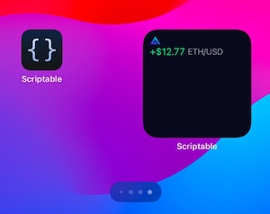
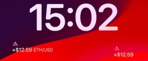
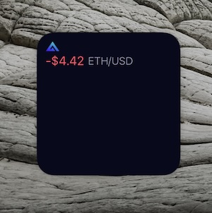
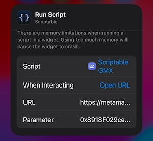

# GMX iOS widget

## Preview

In the home screen:



In the lock screen:



You can also add the widget on Mac



## Prerequisites

- Scriptable - [Site](https://scriptable.app), [App Store](https://apps.apple.com/us/app/scriptable/id1405459188)
- MetaMask - [Site](https://metamask.io) (optional)

## Installation

1. Download the [Scriptable GMX.scriptable](<./Scriptable GMX.scriptable>) or send it to your iPhone in any messaging app
2. Open a share sheet (Activity View) and select Scriptable app. If there is no such option, try scolling to the right and tap on "more".
3. Tap on "Add to My Scripts"

## Configuration

- [Apple docs for iOS home screen widgets](https://support.apple.com/en-il/guide/iphone/iphb8f1bf206/ios)
- [Apple docs for iOS lock screen widgets](https://support.apple.com/en-il/guide/iphone/iph4d0e6c351/18.0/ios/18.0#iphf41752ab8)
- [Apple docs for Mac desktop and notification center widgets](https://support.apple.com/guide/mac-help/add-and-customize-widgets-mchl52be5da5/mac)

1. After adding a bare Scriptable widget. Edit it.
2. In "Script" section, select "Scriptable GMX"
3. (Optional) In "When Interacting" section, select "Open URL" and set `https://metamask.app.link/dapp/https://app.gmx.io/#/trade/long`.
4. In "Parameter" section, set your account address `0x1234...4567`.



## Notes

- The refresh rate is controlled by iOS. So it is usually lagging behind the actual positions by minutes.

## Development

To speed up the development, link the script file from iCloud Scriptable folder to the one on your computer by running:

```bash
npm run link
# or
ln -s ~/Library/Mobile\\ Documents/iCloud~dk~simonbs~Scriptable/Documents/Scriptable\\ GMX.js index-linked.js
```

This should create an `index-linked.js` file in the root of the project where you can edit the script. Changes to this file will update the script in real time and you can reran the script on iOS by just refreshing the widget after a few seconds.

To export scriptable object (`.scriptable` file), run:

```bash
npm run export
```

You can then send the `Scriptable GMX.scriptable` file to your iPhone in any messaging app.
